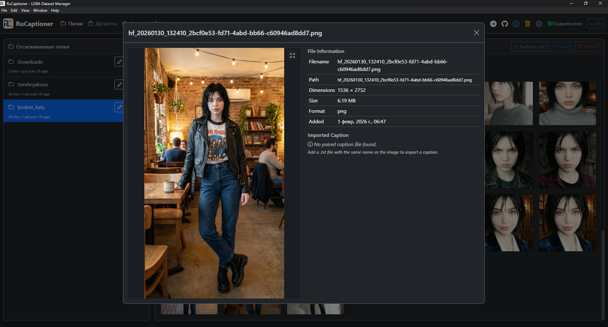

# RuCaptioner

**Локальный AI-инструмент для подготовки датасетов изображений к обучению LoRA.** RuCaptioner генерирует описания (captions) с помощью локальных vision-моделей, помогает отбирать изображения, редактировать и оценивать тексты, а затем экспортировать готовый датасет — без облачных API и передачи данных наружу.


*Интерфейс редактирования описаний с генерацией на базе ИИ, оценкой качества и пакетной обработкой*

> [!NOTE]
> RuCaptioner основан на проекте [Caption Foundry](https://github.com/whatsthisaithing/caption-foundry). Эта версия сфокусирована на русскоязычном workflow, портативном запуске в Windows, встроенном переводе, управлении seed и стабильной работе с LM Studio.
>
> 💬 **Обновления и поддержка:** [@dim_2id](https://t.me/dim_2id)

## 📥 Скачать

**[Скачать последнюю версию (Portable ZIP)](https://github.com/Lisadm/RuCaptioner/releases/latest)**
*Не требует установки. Просто распакуйте и запустите `RuCaptioner.exe`.*

## Отличия RuCaptioner

Версия развивает исходный проект в сторону удобной ежедневной работы с локальными моделями. Основные изменения:

1.  **🇷🇺 Полная локализация**: Документация переведена на русский язык, интерфейс адаптирован.
2.  **🗣 Встроенный переводчик**: Добавлена кнопка перевода в редакторе — можно мгновенно переводить сгенерированные английские капшны на русский.
3.  **💼 Портативная версия**: Все данные (база данных, настройки, логи) хранятся внутри папки проекта. **Не требует установки Python, Node.js или Git** — просто скачай и работай.
4.  **🛑 Graceful Shutdown**: Исправлена проблема "зомби-процессов". Приложение гарантированно завершает все процессы (Python бэкенд, Electron) при закрытии.
5.  **🎲 Управление Seed**: Добавлено поле Seed для контроля генерации. Можно воспроизводить результаты или экспериментировать с вариациями.
6.  **⚡ Оптимизация**: 
    *   Удалена поддержка Ollama (фокус на стабильную работу с LM Studio).
    *   Удалены устаревшие "жесткие" шаблоны (Natural/Detailed/Tags) в пользу гибких промптов.
    *   Улучшена работа с файловой системой.
7.  **🗑 Безопасная Корзина**: Удаленные файлы попадают в корзину (лимит 100 файлов) с возможностью восстановления.
8.  **✂️ Отбор и фильтрация (Culling)**: Удаление изображения в приложении автоматически удаляет и связанный `.txt` файл — то, чего не хватало в оригинале.
9.  **📝 UTF-8**: Все текстовые файлы сохраняются строго в UTF-8. При открытии старых файлов в других кодировках они автоматически конвертируются в UTF-8.

---

## Что такое RuCaptioner?

RuCaptioner упрощает утомительный процесс подготовки датасетов для обучения ИИ. Вместо того чтобы вручную подписывать сотни картинок, вы можете:

1. **Организовать** изображения по папкам с помощью Drag-and-Drop
2. **Отсеять (Cull)** неудачные кадры — удаление картинки стирает и её описание
3. **Автоматически описать** весь датасет, используя локальные Vision-модели (через LM Studio)
4. **Проверить и отредактировать** описания с подсказками и оценкой качества
5. **Экспортировать** идеально отформатированный датасет, готовый к обучению (Kohya_ss, OneTrainer и др.)

Весь процесс происходит локально на вашем компьютере: без облачных сервисов, платных API и передачи датасета третьим сторонам.

## Ключевые возможности

- **Отслеживание папок** - Работайте с локальными папками, просто перетащив их в приложение
- **Умная галерея** - Быстрая сетка миниатюр с lazy-loading и WebP сжатием
- **Управление датасетами** - Группируйте изображения в именованные наборы
- **Гибкие шаблоны описаний** - Выбирайте стиль: теги (Danbooru), естественный язык или детальное описание
- **Seed Management** - Фиксируйте сид для воспроизводимых экспериментов с промптами
- **AI-капшнинг** - Генерация описаний через локальные модели (Qwen, LLaVA) в LM Studio
- **Встроенный переводчик** - Переводите описания на нужный язык прямо в редакторе
- **Оценка качества** - Автоматическая пометка проблемных описаний
- **Ручное редактирование** - Кликните на любое фото для быстрого исправления текста
- **Безопасное удаление** - Встроенная корзина с возможностью восстановления файлов
- **Умный Экспорт** - Последовательная нумерация файлов, конвертация форматов, очистка метаданных
- **Настольное приложение** - Desktop-интерфейс на базе Electron

## Требования

> [!TIP]
> **Если вы используете Portable-версию**: Вам **НУЖЕН ТОЛЬКО LM Studio**. Все остальное уже встроено.

**Для запуска из исходного кода (Разработчикам):**
- **Python 3.10+** - [Скачать](https://python.org)
- **Node.js 18+** - [Скачать](https://nodejs.org)

**Для всех версий:**
- **LM Studio** - Запущенный в режиме сервера с загруженной Vision-моделью (например, Qwen2.5-VL)

> **Новичок?** Читайте [QUICKSTART.md](QUICKSTART.md) для пошаговой инструкции по установке.

## Установка

### Windows

```batch
install.bat
```

### Linux/macOS

```bash
chmod +x install.sh
./install.sh
```

Установщик автоматически создаст виртуальное окружение Python (venv) и установит все необходимые зависимости.

## Запуск

### Portable-версия (Рекомендуется)
1. Скачайте ZIP-архив.
2. Распакуйте в любую папку.
3. Запустите **`RuCaptioner.exe`**.

### Из исходного кода (Разработчикам)
**Windows:**
```batch
start.bat
```

**Linux/macOS:**
```bash
./start.sh
```

Это запустит:
1. Сервер бэкенда на Python (порт 8675)
2. Приложение Electron (интерфейс)


## Конфигурация

Настройки хранятся в `config/settings.yaml`:

```yaml
vision:
  backend: lmstudio
  lmstudio_url: http://localhost:1234
  default_model: qwen/qwen2.5-vl-7b
  max_tokens: 4096             # Важно для подробных описаний
  timeout_seconds: 120

thumbnails:
  max_size: 256
  quality: 85
  format: webp

export:
  default_format: jpeg
  default_quality: 95
  default_padding: 6           # Количество цифр в имени файла (000001.jpg)
```

## Структура проекта

```
RuCaptioner/
 electron/           # Electron (интерфейс)
    main.js         # Точка входа, запускает Python
 backend/            # Python FastAPI бэкенд
    api/            # API эндпоинты
    services/       # Логика приложения
    models.py       # Модели базы данных (SQLAlchemy)
 frontend/           # Веб-интерфейс
    css/styles.css  # Стили
    js/             # Логика интерфейса
    index.html      # Главная страница
 config/             # Конфигурация
 data/               # Хранилище данных (БД, кэш)
 install.bat/.sh     # Скрипты установки
 start.bat/.sh       # Скрипты запуска
```

## Разработка

### Запуск с DevTools

```bash
npm run dev
```

## Решение проблем

### "No vision models available"

Убедитесь, что LM Studio запущен в режиме **Server** (зеленая кнопка Start Server) и в нем загружена модель с поддержкой зрения (Vision), например Qwen2.5-VL.

### Описания обрываются

Увеличьте параметр `max_tokens` в файле `config/settings.yaml`. Современные модели могут писать очень длинные тексты.

### Программа не закрывается полностью

В последних версиях мы добавили **Graceful Shutdown**. Если процесс все же висит, используйте `taskkill` или диспетчер задач, но обычно приложение само убивает все свои дочерние процессы.

## Лицензия

Apache 2.0 - См. файл [LICENSE](LICENSE).

## Ссылки

- [QUICKSTART.md](QUICKSTART.md) - Быстрый старт и инструкция
- [API Documentation](http://localhost:8675/docs) - Документация API
